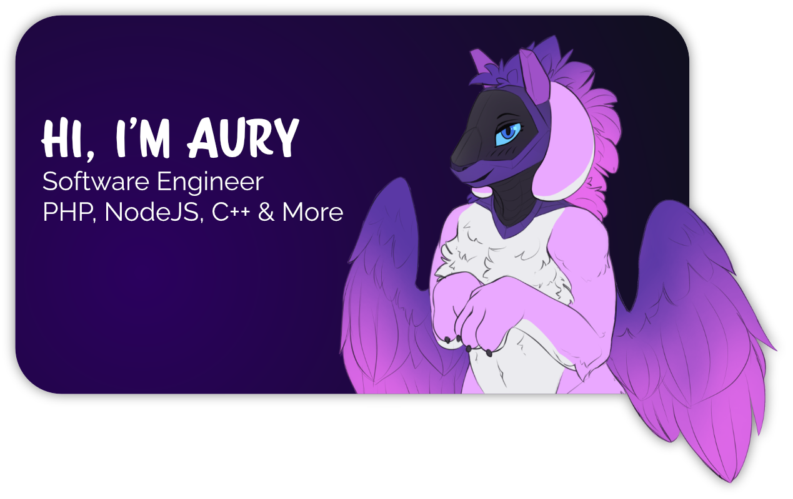

    

Hi there! I'm Aurorah. I'm a full-stack web and software developer from New Zealand. In my spare time I work on projects such as game development, 3D art, content creation, learning new technologies, running communities and more. My aim is to turn the internet into a more friendly and inviting environment for everyone, and I'm glad you're along for the journey. If you're interested in my work, feel free to follow my socials below, or support me on [ko-fi](https://ko-fi.com/aurorahHarmony).

    
    
    

    

